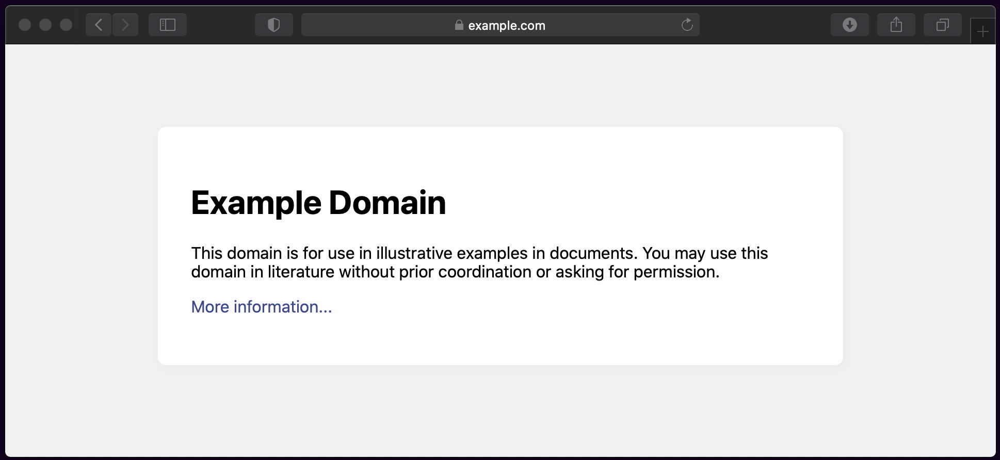

# wget snapshot of EXAMPLE_SITE (template repo)

This repo contains a working mirror of [EXAMPLE_SITE](https://example.com) – as well as the [wget script and other code](#mark-code) to reproduce the mirror.

- Mirror: https://wgetsnaps.github.io/TEMPLATE/
- Original: https://example.com/
- Wayback: https://web.archive.org/web/*/https://example.com/
- Updated at: 2020-11-10

## Code and data

See [wgetsnap.sh](wgetsnap.sh) to check out the `wget` code for mirroring the site.

## Related

- Related link: https://example.com
- related link 2: https://www.gnu.org/software/wget/manual/wget.html

## Developer notes

If you've cloned this repo and want to recreate the wget mirror yourself, check out the [Makefile](Makefile).

Basically:

- `make snap` to execute script(s) for creating a mirror of the target site mirroring the target site (if ./docs doesn't already exist)

- `make serve` to view the locally mirrored site

- `make clean`  to clean out an existing mirror (wget.log and ./docs/)

